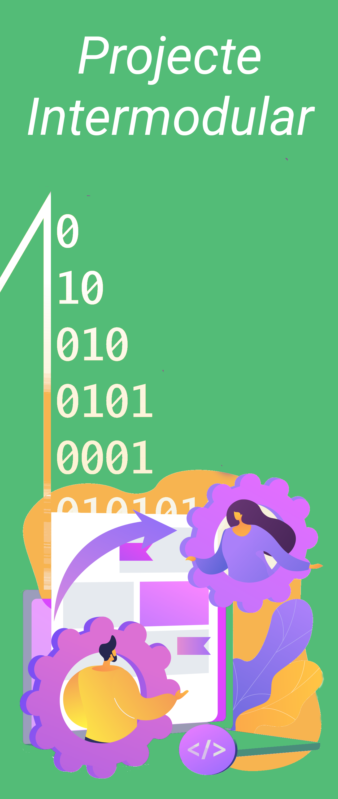

---
hide:
  - navigation
  - toc
---

  

    
  

  

  

            

                <a href="presentacio/index.html">
                    
Presentació del mòdul

                    

                        
                    

                </a>
            

            

                <a href="introduccio/index.html"> 
                    
GUIA DEL MÒDUL

                    

                        
                    

                </a> 
            

            

                <a href="ud1/index.html"> 
                    
Unitat 1. Anàlisi de requisits

                    

                        
                    

                </a> 
            

            

                <a href="ud2/index.html">
                    
Unitat 2. Disseny

                    

                        
                    

                </a>
            

            

                <a href="ud3/index.html"> 
                    
Unitat 3. Planificació

                    

                        
                    

                </a> 
            

            

                 <a href="ud4/index.html"> 
                    
Unitat 4. Avaluació i Presentació

                    

                        
                    

                 </a> 
            

        
    

